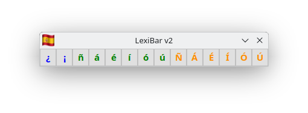

# LexiBar v2


## Aperçu
LexiBar v2 est une barre d'outils légère et efficace qui permet d'accéder rapidement aux caractères spéciaux espagnols. L'application reste toujours au premier plan de votre écran et vous permet de copier instantanément des caractères dans le presse-papier ou de les glisser-déposer dans vos documents.



## Fonctionnalités
- **Accès rapide aux caractères espagnols** : ¿ ¡ ñ á é í ó ú Ñ Á É Í Ó Ú
- **Code couleur intuitif** : bleu pour les signes d'interrogation et d'exclamation, vert pour les minuscules accentuées, orange pour les majuscules accentuées
- **Copier-coller simple** : un clic suffit pour copier un caractère
- **Glisser-déposer** : drag and drop des caractères dans vos applications
- **Toujours au premier plan** : reste visible par-dessus vos autres fenêtres
- **Légère et compacte** : occupe un minimum d'espace sur votre écran
- **Sans installation** : application portable et légère

## Prérequis
- **Qt** : 6.8 ou supérieur
- **Compilateur C++** : GCC, Clang ou MSVC
- **CMake** : 3.16 ou supérieur

## Installation

### Compilation depuis les sources
```bash
# Cloner le dépôt
git clone https://github.com/votre-username/LexiBar-v2.git
cd LexiBar-v2

# Créer le répertoire de build
mkdir build && cd build

# Générer les fichiers de build avec CMake
cmake ..

# Compiler
make

# Exécuter
./lexibarv2
```

## Utilisation
1. Lancez l'application LexiBar v2.
2. La barre d'outils apparaît en haut de votre écran.
3. Cliquez sur un caractère pour le copier dans le presse-papier.
4. Un feedback visuel (animation verte) confirme la copie.
5. Collez le caractère dans n'importe quelle application avec `Ctrl+V` (ou `Cmd+V` sur macOS).
6. Alternativement, glissez-déposez un caractère directement dans votre document.

## Structure du projet
```
LexiBar-v2/
├── CMakeLists.txt        # Configuration CMake
├── build/                # Répertoire de build
│   └── Lexibar-v2        # Exécutable de l'application
├── src/                  # Code source C++
│   ├── main.cpp          # Point d'entrée de l'application
│   ├── gestionlexibar.h  # Classe pour la gestion du presse-papier
│   └── gestionlexibar.cpp
├── qml/                  # Interface utilisateur QML
│   └── main.qml          # Interface principale
├── ressources/           # Ressources de l'application
│   ├── qml.qrc           # Fichier de ressources Qt
│   └── media/            # Images et icônes
│       └── drapeau.png   # Icône de l'application
├── README.md             # Documentation du projet
└── screenshot.png        # Capture d'écran de l'application
```

## Technologies utilisées
- **Qt 6** : Framework d'interface utilisateur multiplateforme
- **QML** : Langage déclaratif pour la conception d'interfaces
- **C++** : Langage de programmation pour la logique métier
- **CMake** : Système de build multiplateforme

## Contribuer
Les contributions sont les bienvenues ! Pour contribuer :

1. Fork le projet.
2. Créez une branche pour votre fonctionnalité :
   ```bash
   git checkout -b feature/amazing-feature
   ```
3. Committez vos changements :
   ```bash
   git commit -m 'Add some amazing feature'
   ```
4. Poussez vers la branche :
   ```bash
   git push origin feature/amazing-feature
   ```
5. Ouvrez une Pull Request.

## Licence
Ce projet est distribué sous licence MIT. Voir le fichier [LICENSE](LICENSE) pour plus d'informations.

## Contact
Créé par [Mikaël MAUNIER] - n'hésitez pas à me contacter !

- **GitHub** : [@mmaunier](https://github.com/mmaunier)
- **Email** : mmaunier2009@gmail.com